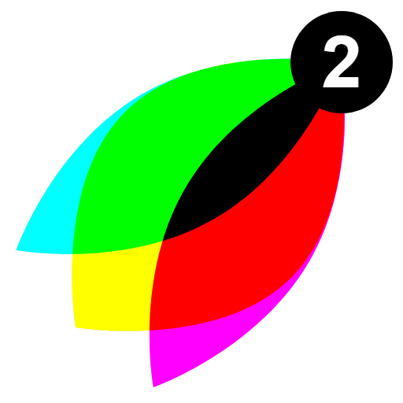

<p align="center">
  
</p>

# VisBug2

> Open source browser design and debugging tools

[](https://github.com/node-projects/ProjectVisBug2/actions/workflows/test.yml)
[](https://github.com/node-projects/ProjectVisBug2/actions/workflows/pages.yml)

**[Try the VisBug2 demo](https://node-projects.github.io/ProjectVisBug2/)**

VisBug2 is a community-maintained fork of the original
[VisBug project](https://github.com/GoogleChromeLabs/ProjectVisBug). Our sincere
thanks go to [Adam Argyle](https://argyleink.com), VisBug's creator and original
author, and to everyone who contributed to the upstream project. VisBug2 keeps
that work available and maintained while the original hosted demo is offline.

## What it does

- Point, click, and tinker with any web page
- Hold Shift to multi-select elements
- Inspect styles, accessibility, and alignment on hover
- Nudge layouts with familiar design-tool keyboard controls
- Edit text and replace images
- Traverse the DOM like groups and layers in a design tool
- Explore responsive layouts and unusual application states in their real environment

VisBug2 complements design tools such as Figma and Sketch. It is intended for
editing and testing an existing browser state, rather than authoring a design
from scratch.

## Demo

The interactive playground is hosted on GitHub Pages:

**https://node-projects.github.io/ProjectVisBug2/**

It is rebuilt and deployed automatically from the `main` branch by
[the Pages workflow](.github/workflows/pages.yml).

## Installation

### Develop locally

```sh
git clone https://github.com/node-projects/ProjectVisBug2.git
cd ProjectVisBug2
npm install
npm start
```

Then open <http://localhost:3000>.

### Build

```sh
npm run bundle
```

The static demo is generated in `app/`.

### Selection-menu plug-ins

Plug-ins can add commands to the selected-element menu. The menu is hidden when
no active plug-in contributes an action. A parent action without a command
becomes a submenu:

```js
const visbug = document.querySelector('vis-bug')

const plugin = visbug.registerPlugin({
  id: 'copy-example',
  commands: ['copy-example-json'],
  execute: ({source, selected, query}) => {
    // `source` is the element whose menu was used.
  },
  selectionActions: [
    {id: 'copy-example', label: 'Copy as'},
    {
      id: 'copy-example-json',
      parentId: 'copy-example',
      label: 'JSON',
      command: 'copy-example-json',
    },
  ],
})

plugin.deactivate()
plugin.activate()
plugin.unregister()
```

Built-in plug-ins can also be toggled with
`visbug.setPluginActive('export', false)`. The export plug-in is active by
default.

### Browser extensions

VisBug2 retains the browser-extension sources from upstream. The currently
published store listings belong to the original VisBug project:

- [Chrome extension](https://chrome.google.com/webstore/detail/cdockenadnadldjbbgcallicgledbeoc)
- [Firefox add-on](https://addons.mozilla.org/en-US/firefox/addon/visbug/)
- [Safari extension](https://apps.apple.com/app/id1538509686)
- [Edge extension](https://microsoftedge.microsoft.com/addons/detail/visbug/kdmdoinnkaeognnpegpkepdnggeaodkn)

The original project's [wiki](https://github.com/GoogleChromeLabs/ProjectVisBug/wiki)
and [keyboard command reference](https://github.com/GoogleChromeLabs/ProjectVisBug/wiki/Keyboard-Master-List)
remain useful background documentation.

## Contributing

Issues and pull requests are welcome in the
[VisBug2 repository](https://github.com/node-projects/ProjectVisBug2).

1. Fork the repository.
2. Create a feature branch.
3. Install dependencies with `npm install`.
4. Make and test your changes.
5. Open a pull request with a clear description of the change.

Please report VisBug2 problems in the
[VisBug2 issue tracker](https://github.com/node-projects/ProjectVisBug2/issues).
Use the [upstream issue tracker](https://github.com/GoogleChromeLabs/ProjectVisBug/issues)
only for matters specific to the original project.

## License and attribution

VisBug2 remains available under the [Apache License 2.0](LICENSE).

The original VisBug project is © [Adam Argyle](https://argyleink.com) and its
contributors. VisBug2 is derived from
[GoogleChromeLabs/ProjectVisBug](https://github.com/GoogleChromeLabs/ProjectVisBug)
with gratitude to its author and community.
